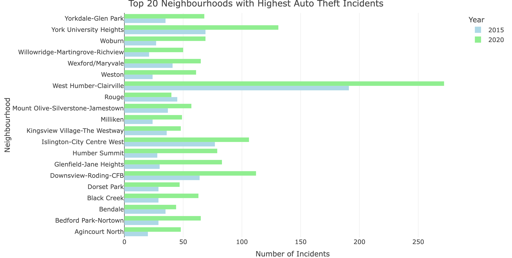
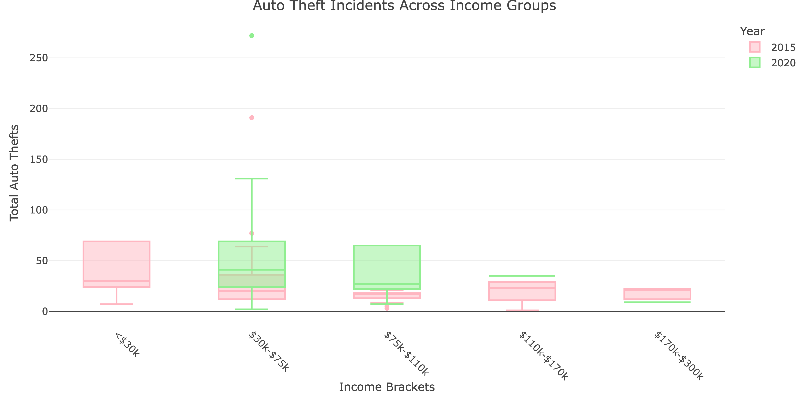
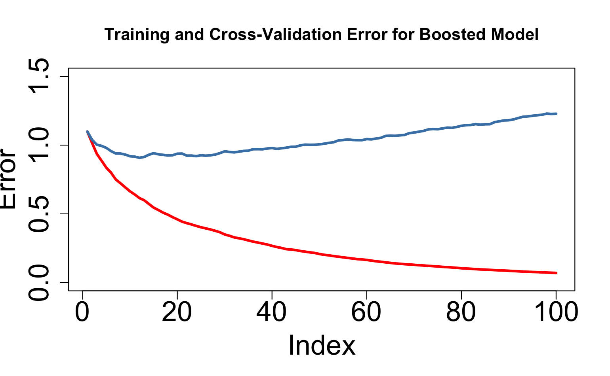
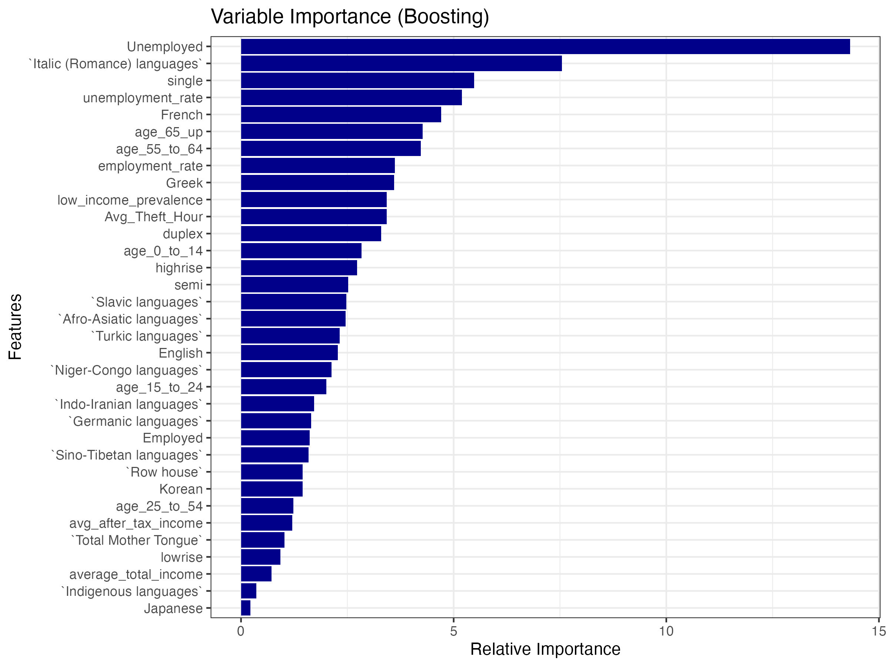
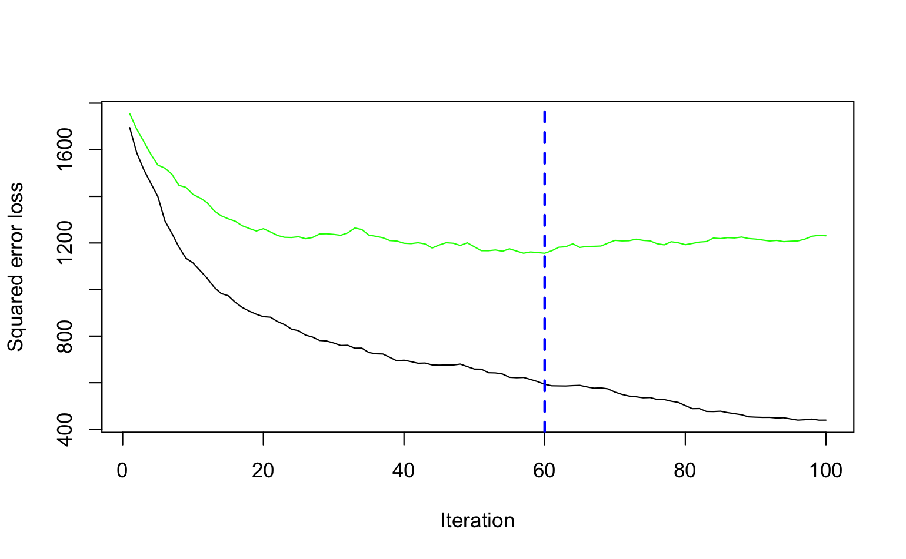
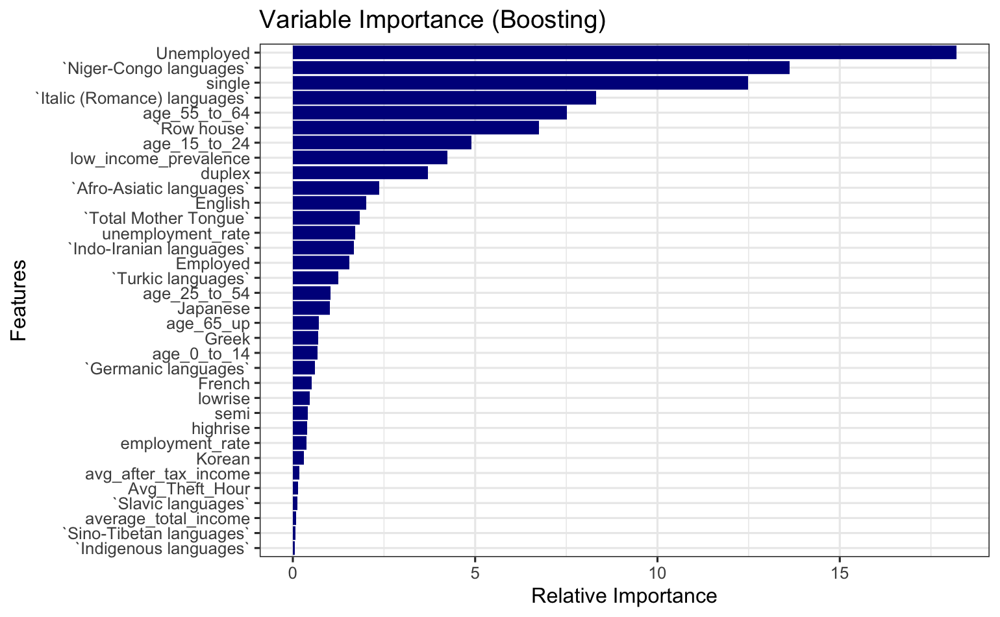

```{r, message=FALSE, echo=FALSE, error=FALSE, warning=FALSE}
# rmarkdown::render("Final-Report.Rmd", output_format = "pdf_document", clean = TRUE)
```

```{r setup, message=FALSE, echo=FALSE, error=FALSE, warning=FALSE}
library(httr)
library(jsonlite)
library(dplyr)
library(glue)
library(stringr)
library(tibble)
library(opendatatoronto)
library(knitr)
library(kableExtra)
library(ggplot2)
library(ggcorrplot)
library(wordcloud)
library(RColorBrewer)
library(tidyr)
library(rpart)
library(rpart.plot)
library(randomForest)
library(gbm)
library(xgboost)
library(caret)
library(mgcv)
library(plotly)
library(webshot2)
library(leaflet)
```

```{r, message=FALSE, echo=FALSE, error=FALSE, warning=FALSE}
hd2021_census <- read.csv("Data_Wrangling/hd2021_census.csv", check.names = FALSE)
census_data <- read.csv("data/census_data.csv", check.names = FALSE)
auto_theft_census <- read.csv("data/auto_theft_census.csv", check.names = FALSE )
```

# Introduction 
## Background 
Auto theft is a prominent concern in urban environments, and the City of Toronto is no exception. Beyond being a property crime, auto theft is often intertwined with broader criminal activity, including organized crime, fraud, and illicit resale markets. For vehicle owners, the theft of a car can be more than just an inconvenience: it can disrupt their daily lives, limit access to work and essential services, and cause heavy financial strain due to insurance claims, replacement costs, and legal processes. From a more comprehensive perspective, high auto theft rates may indicate deeper socioeconomic issues, such as income inequality, unemployment, or systemic vulnerabilities within certain neighbourhoods. 

## Research Question
Toronto, Canada's largest city, frequently reports cases of vehicle theft, often covered in the media. However, beyond simply the headlines, an important question arises: are there identifiable patterns or relationships between auto theft rates in Toronto and socioeconomic factors? Do economic conditions, such as an individual's income, household income, type of living area (e.g., apartment buildings over five storeys, under five storeys, duplexes, townhouses, single-detached homes, semi-detached homes), languages spoken in the neighbourhood, or employment levels, correspond to higher rates of vehicle-related crime?

Thus, the goal of this analysis is to explore the relationship between auto theft rates in Toronto and various socioeconomic factors, seeking to understand the question: Do certain socioeconomic conditions serve as indicators for higher rates of vehicle-related crime?

Furthermore, this analysis explores which modelling approach, like decision trees, linear regression, or boosting methods (like GBM and XGBoost), best captures the relationship between socioeconomic conditions and auto theft rates, evaluating both classification and regression models for overall performance.

## Data Sources
To explore the relationship between auto theft and socioeconomic factors in Toronto, this analysis utilizes census datasets from the **Toronto Open Data Neighbourhood Profiles**. 

Since Canadian census data is collected every five years and released the following year, I have chosen to examine the census data published in 2016 and 2021, which correspond to socioeconomic conditions in 2015 and 2020, respectively. These datasets provide a wealth of information, including demographic characteristics, income levels, employment and unemployment rates, and linguistic diversity, and housing characteristics across Toronto’s neighbourhoods. 

In addition to the census data, this analysis incorporates the **Toronto Police Service Auto Theft Open Data**, which contains reported incidents of vehicle theft across the city. By integrating these datasets, this study aims to identify potential correlations between socioeconomic conditions and auto theft rates, offering insights into whether certain neighbourhood characteristics may be indicative of higher rates of vehicle-related crimes. 

# Methods 
## Data Acquisition 
The datasets used in this analysis were obtained from the **Toronto Open Data Portal** and the **Toronto Police Open Data Service**. 
 
Although the 2021 Neighbourhood Profiles dataset was available for direct download as an XLSX file from the City of Toronto’s Open Data Portal, I opted for programmatic access via Toronto’s `CKAN` API instead to ensure reproducibility and scalability. Specifically, I leveraged the R-based API wrapper functions `list_package_resources()` and `get_resource()` from the `CKAN` package. Using these `R` utilities, I first identified all available census resources by querying the "Neighbourhood Profiles" package with the `list_package_resources()` function. This function returned metadata for datasets spanning from 2006 to 2021. From these results, I specifically extracted the 2021 Census profile resource ID using `get_resource()`, obtaining a structured dataset containing 158 socioeconomic variables across Toronto's 140 neighbourhoods, including key indicators like income distribution, demographic breakdowns, housing details, and employment statistics. Overall, this process involved querying metadata, identifying the correct dataset, and extracting structured data from the response.

The 2016 Neighbourhood Profiles dataset was acquired slightly differently. Originally, I tried acquiring the dataset by retrieving the package ID associated with the 2016 dataset. However, unlike the 2021 dataset, it lacked crucial socioeconomic indicators, such as average household income at the neighbourhood level. To supplement this missing information, I identified an alternative data source, a Kaggle Notebook, that demonstrated an approach for deriving neighbourhood-level income estimates. I cloned this Kaggle Notebook to adapt the data deriving methodology, and I saved the output into a CSV file, which was then imported into R. This ensured that both the 2016 and 2021 census datasets had consistent columns for direct comparison.

Finally, the Auto Theft dataset was retrieved from the Toronto Police Open Data Service, downloaded directly as a CSV file. This dataset contained detailed records of reported motor vehicle thefts across the city, with key variables including the date and time of the incident, neighbourhood name, and specific location type (e.g., street, parking lot, residential driveway). Basic preprocessing steps included selecting data from only 2015 and 2020, simplifying the dataset for when it is merged later on. 

## Data Cleaning and Wrangling 
Upon inspecting the 2021 and 2016 census data sets, it became evident that the data was structured in a long format, where neighbourhood names were set as column names, and attributes such as income, age, and employment status were stored as row names, as seen in Table 1:
```{r, message=FALSE, echo=FALSE, error=FALSE, warning=FALSE}
middle_index <- 35  
rows_from_middle <- hd2021_census[middle_index:(middle_index + 5), ]  

hd2021_census[middle_index:(middle_index + 5), ] |> 
  select(1:3) |> 
  kable(caption = "Sample of the Unclean 2021 Wide Dataset", align = "c") |>
  kable_styling(font_size = 8,  
    full_width = FALSE
    ) 
```

The original structure of the datasets made analysis difficult. To address this, I transposed both datasets using the `t()` function, converting them from a long format to a wide format. This transformation ensured that each row represented a neighbourhood, with relevant attributes organized into separate columns. As a result, the 2021 census dataset, which initially contained 158 variables and 2,604 observations, was transformed into a dataset with 158 observations and 2,604 attributes. Similarly, the 2016 census dataset, originally comprising 140 variables and 2,184 observations, was restructured into 140 observations and 2,184 attributes.

Upon further investigation, I also found that the 2016 census data only contained data for 140 neighbourhoods, while the 2021 census contained data for 158 neighbourhoods. So, there were some discrepencies between the neighbourhood names and numbers that needed fixing. To fix this inconsistency, I manually changed the neighbourhood names and numbers in the 2021 census to align with the 140 neighbourhood system in the 2016 census data. 

Given that both the 2016 and 2021 datasets contained over 2,000 attributes each, I employed the `select()` function to retain only the key variables pertinent to my analysis. These key variables included demographic characteristics (such as age distribution), economic indicators (such as average income and average household income), employment and unemployment rates, linguistic diversity, and housing types (including apartments, high-rises, low-rises, duplexes, and townhouses). 

Due to inconsistencies in variable naming between the two datasets, I employed the `rename()` function to simplify and standardize the column names, ensuring compatibility for subsequent/future row binding. Once both datasets were cleaned, two additional columns were added:

* NEIGHBOURHOOD_140: A reformatted neighbourhood identifier that facilitated merging with the auto theft dataset.
* Year: A column specifying the corresponding census year (2015 for the 2016 census and 2020 for the 2021 census).

However, a significant issue I encountered during cleaning was that all values in the 2021 dataset were stored as character data, while the 2016 dataset contained numerical values (except for neighbourhood names). To resolve this inconsistency, all numeric variables in the 2021 dataset were converted to numeric data types using the `as.numeric()` function, thereby ensuring uniformity across both datasets. Finally, the two cleaned census datasets were merged into a single dataset with the help of `rbind()`, resulting in a unified socioeconomic dataset covering both 2015 and 2020 for Toronto neighbourhoods containing 298 observations and 42 attributes. 

Table 2 summarizes the merged dataset, highlighting some of the key attributes retained from each census dataset, and shows the result of the data transposition:
```{r, message=FALSE, echo=FALSE, error=FALSE, warning=FALSE}
census_data |>
  select(`Neighbourhood Name`, `Average total income`, `Low Income Prevalence (LIM-AT) %`, `Unemployment rate`) |> 
  head(5) |>  
  kable(caption = "Neighbourhood Income Summary", align = "c") |>
  kable_styling(font_size = 8,
    full_width = FALSE
    ) 
```

Finally, the combined census dataset was merged with the Auto Theft dataset. I merged them using two key attributes: 

* NEIGHBOURHOOD_140 (to match neighbourhoods across datasets).
* Year and REPORT_YEAR (to ensure data alignment by year).

The final dataset, `auto_theft_census.csv` has 8402 observations and 71 columns/attributes. These pre-processing steps ensured that the final dataset was structured for further analysis, enabling an investigation into the relationship between socioeconomic factors and auto theft rates across Toronto’s neighbourhoods, as well as a comparison of classification and regression modeling approaches.

## Data Exploration Tools
After wrangling and cleaning the data, I performed a 70/30 split to create training (70%) and testing (30%) datasets. My exploratory data analysis (EDA) was conducted solely on the training dataset to prevent any bias or influence from the testing set, ensuring that my analysis and model evaluation remained unbiased.

During the EDA, I examined various predictors and explored many potential relationships, particularly focusing on whether socioeconomic factors were associated with the frequency of auto thefts in different neighbourhoods. I tested multiple interactions and examined patterns that might provide insights into these relationships.

Some specific tools include using `ggplot2` for visualizing data through various plots: 

  * Bar plots to compare categorical data 
  * Scatter plots with regression lines to visualize relationships between predictors and outcomes
  * Line plots to explore trends over time or other continuous variables
  * Box-and-whisker plots to examine the distribution and spread of data.
  
Each of these plots was used to explore potential correlations and patterns, helping to identify meaningful socioeconomic factors that might influence auto theft rates.

I also used `kable` to create summary statistics, providing a concise view of the key metrics in the data.

Finally, I used `Plotly` and `Leaflet` to create interactive visualizations for my website, enabling dynamic exploration of the data.

## Modelling Methods

For modelling, I decided to do both classification and regression models. For both the classification and regression tasks, I used several models to capture the relationships between socioeconomic factors and auto theft occurrences across neighbourhoods. I chose to perform both classification and regression because classification allows me to categorize neighbourhoods by risk level for targeted interventions, while regression provides a more detailed prediction of the actual number of auto thefts to support resource planning and policy decisions.

**Classification Models:**

The classification models are used to predict auto theft levels, categorized as low, medium, and high.

1. Decision Trees: A decision tree is a supervised learning algorithm that partitions data through recursive binary splits, selecting optimal features at each node to maximize predictive accuracy. The resulting tree structure terminates in leaf nodes, representing final class assignments. Some key factors of decision trees include its nonlinear decision boundaries and simple interpretibility. However, decision trees are prone to overfitting. 

2. Gradient Boosting Model (GBM): GBM is an ensemble method that builds a series of decision trees in a sequential manner, with each tree attempting to correct the errors made by the previous one. The trees are built by minimizing a loss function using gradient descent. GBM is also prone to overfitting, especially if it is not regularized properly. 

For evaluating classification models, I will use:

* Accuracy: the percentage of correctly classified instances.

* Confusion Matrix: a table that provides a detailed breakdown of model performance by showing true positives, true negatives, false positives, and false negatives.

These metrics are appropriate because they provide a clear measure of overall predictive success and help identify specific types of classification errors (e.g., misclassifying "high" as "medium", or "medium" as "high").

**Regression Models**

The regression models will be compared to assess which one serves as a better predictor for auto theft counts (a continuous variable).

1. Decision Trees for Regression: This is similar to classification decision trees. The difference is that they predict continuous values instead of discrete class labels. The tree splits the data based on feature values to minimize the variance of the target variable within each leaf.

2. Gradient Boosting Machines (GBM): Used for regression tasks as well, GBM builds decision trees iteratively to minimize the error of previous trees, but in this case, the objective is typically to minimize a loss function such as mean squared error (MSE). Most of the time, this model often performs better than simpler models, due to its ability to capture more complex patterns. However, regularization is crucial factor of GBM in order to prevent overfitting.

3. XGBoost: This is a specific implementation of boosting that is optimized for speed and accuracy. XGBoost builds trees in a manner similar to GBM, but it offers better performance with additional regularization and optimization features. It is considered robust and efficient, especially for larger datasets.

4. Linear Regression: This model is used as a baseline. It assumes a linear relationship between the independent variables/predictors and the dependent variable/target. The model minimizes the sum of squared residuals (differences between the predicted and the actual values). For this analysis, I first applied it on a full model including all predictors, and then I used stepwise selection based on the Akaike Information Criterion (AIC) to refine the model. AIC is a metric that balances model fit and complexity. AIC rewards goodness of fit, while penalizing the inclusion of unnecessary variables, helping to avoid overfitting.

For the regression models, I will be comparing their: 

* $R^2$ (Coefficient of Determination): The $R^2$ value measures the proportion of variance in the dependent variable that is predictable from the independent variables. A higher $R^2$ values indicate a better model performance. 
* RMSE (Root Mean Squared Error): RMSE is a measure of the differences between predicted and actual values. Lower RMSE values indicate better model performance.


# Results 
## Exploratory Data Analysis (EDA)
```{r, message=FALSE, echo=FALSE, error=FALSE, warning=FALSE}
set.seed(1250)
train <- sample(1:nrow(auto_theft_census), round(0.7 * nrow(auto_theft_census)))
train_data <- auto_theft_census[train, ]
test_data <- auto_theft_census[-train, ]
```

To gain insights into auto theft trends in Toronto and their potential socioeconomic correlations, I first created a summary statistics table with the training data. This table presents key values, including:

* Total auto thefts recorded in 2015 and 2020.
* Average total income in Toronto for each year.
* Unemployment rate (%), which reflects the percentage of unemployed individuals in the labor force.
* Low-income prevalence (%), indicating the proportion of the population classified as low-income.

```{r echo=FALSE, error=FALSE, warning=FALSE, message=FALSE}
auto_theft_summary <- train_data |>
  group_by(REPORT_YEAR) |>
  summarise(
    Total_Auto_Theft = n(),
    Average_Income = mean(`Average total income`, na.rm = TRUE),
    Unemployment_Rate = mean(`Unemployment rate`, na.rm = TRUE),
    Low_Income_Prevalence = mean(`Low Income Prevalence (LIM-AT) %`, na.rm = TRUE)
  ) |>
  mutate(across(where(is.numeric), ~ round(.x, 2))) 

kable(
  auto_theft_summary, 
  caption = "Summary Statistics for Auto Theft and socioeconomic Factors",
  caption.placement = "top", 
  caption.bold = TRUE         
) |>
  kable_styling(
    "striped", 
    full_width = FALSE, 
    position = "center",
    font_size = 8
  ) |>
  add_header_above(c(" " = ncol(auto_theft_summary)), bold = TRUE, color = "blue") |>
  footnote(
    general = "Data source: auto_theft_census.csv",
    general_title = "Note:",
    footnote_as_chunk = TRUE
  ) |>
  row_spec(0, bold = TRUE, color = "white", background = "#4C4C4C") 
```

In Table 3, we can see that using the training data, there is an increase in the total number of auto thefts between 2015 and 2020, rising from 2,263 to 3,618. On the contrary, the average income remains rather stagnant, with instead a slight decrease from $50,273.53 in 2015 to \$49,081.37 in 2020. We do see, however, see that there is a surge in the unemployment rate, rising sharply from 8.59% in 2015 to 14.56% in 2020. This is likely influenced by the economic disruptions from the COVID-19 pandemic, and I will take this into account for this analysis. Finally, Table 3 shows us that the percentage of the population classified as low-income declined from 19.46% to 12.10%, suggesting potential improvements in economic conditions for some groups.

```{r echo=FALSE, error=FALSE, warning=FALSE, eval=FALSE, message=FALSE}
neighbourhood_summary <- train_data |>
  filter(!is.na(NEIGHBOURHOOD_140)) |>
  group_by(NEIGHBOURHOOD_140) |>
  summarize(Total_Auto_Theft = n(), .groups = "drop")

neighborhood_locations <- train_data |>
  filter(!is.na(NEIGHBOURHOOD_140) & !is.na(LAT_WGS84) & !is.na(LONG_WGS84)) |>
  group_by(NEIGHBOURHOOD_140) |>
  summarize(lat = mean(LAT_WGS84), lon = mean(LONG_WGS84), .groups = "drop")

crime_map_data <- left_join(neighbourhood_summary, neighborhood_locations, by = "NEIGHBOURHOOD_140")

pal = colorNumeric(palette = rev(viridis::magma(256)), domain = crime_map_data$Total_Auto_Theft)

leaflet <- leaflet(crime_map_data) |>
  addTiles() |>  
  addCircleMarkers(
    ~lon, ~lat, 
    radius = ~sqrt(Total_Auto_Theft) * 2, 
    color = ~pal(Total_Auto_Theft),
    fillColor = ~pal(Total_Auto_Theft),
    fillOpacity = 1.0,
    popup = ~paste0("<b>Neighborhood: </b>", NEIGHBOURHOOD_140, "<br>",
                    "<b>Total Crimes: </b>", Total_Auto_Theft)
  ) |>
  addLegend(
    position = "bottomright",
    pal = pal,
    values = crime_map_data$Total_Auto_Theft,
    title = "Crime Count",
    labels = "Higher crimes → Bigger circles"
  ) 

# htmlwidgets::saveWidget(widget = leaflet, file = "./images/leaflet.html")
# webshot(url = "./images/leaflet.html", file = "./images/leaflet.png", delay = 1, zoom = 4, vheight = 500)
```
Now, I want to get a deeper understanding of where the most auto thefts are occurring, specifically which neighbourhood. 

```{=latex}
\begin{wrapfigure}{L}{0.75\textwidth}
\centering
\includegraphics[width=0.9\linewidth]{./images/leaflet.png}
\caption{Auto Theft and socioeconomic Analysis in Toronto}
\label{fig:leaflet}
\end{wrapfigure}
```

The Figure 1 Leaflet map visualizes the spatial distribution of auto theft incidents across different neighbourhoods in Toronto, providing an interactive way to examine crime density and making it easier to quickly identify areas that may require targeted interventions or additional resources. As seen, the large black circle represents the area with the most total auto thefts in 2015 and 2020, whereas the smaller, light yellow circles represent the neighbourhoods with the least amount of auto thefts. 

```{r echo=FALSE, error=FALSE, warning=FALSE, message=FALSE}
train_data <- train_data |>
  group_by(REPORT_YEAR, `Neighbourhood Name`) |>
  mutate(Total_Auto_Thefts = n()) |>
  ungroup()  
```

```{r echo=FALSE, error=FALSE, warning=FALSE, message=FALSE}
top_neighbourhoods <- train_data |>
  group_by(`Neighbourhood Name`) |>
  summarise(total_incidents = sum(Total_Auto_Thefts, na.rm = TRUE)) |>
  arrange(desc(total_incidents)) |>
  head(20) |>
  pull(`Neighbourhood Name`)

top_20_neighbourhoods <- train_data |>
  filter(`Neighbourhood Name` %in% top_neighbourhoods)

top_20_summary <- top_20_neighbourhoods |>
  group_by(`Neighbourhood Name`, REPORT_YEAR) |>
  summarise(Incidents = n(), .groups = "drop")
```


```{r eval=FALSE, message=FALSE, warning=FALSE, echo=FALSE}
barplot <- plot_ly(
  data = top_20_summary,
  x = ~Incidents,
  y = ~`Neighbourhood Name`,
  color = ~factor(REPORT_YEAR),
  colors = c("lightblue", "lightgreen"),
  type = "bar",
  orientation = "h"
) |>
  layout(
    title = "Top 20 Neighbourhoods with Highest Auto Theft Incidents",
    xaxis = list(title = "Number of Incidents"),
    yaxis = list(title = "Neighbourhood"),
    barmode = "group",
    legend = list(title = list(text = "Year")),
    margin = list(l = 100), # add left margin so neighbourhood names fit
    annotations = list(
      list(
        text = "Double Bar Graph of the Top 20 Neighbourhoods",
        xref = "paper", yref = "paper",
        x = 0.5, y = -0.2, showarrow = FALSE,
        font = list(size = 10, style = "italic")
      )
    )
  )

# htmlwidgets::saveWidget(widget = barplot, file = "./images/3_1.html")
# webshot(url = "./images/3_1.html", file = "./images/3_1.png", delay = 1, zoom = 4, vheight = 500)
```
To take a closer look at the comparison between 2015 and 2020, Figure 2 displays the number of auto thefts of the top 20 neighbourhoods with the most reported cases of auto theft.

```{r, echo=FALSE, out.width='90%', fig.align='center', fig.pos='H', fig.cap='Double Bar Graph of the Top 20 Neighbourhoods'}


# 
```

From Figure 2 (and the Leaflet map in Figure 1), we can see that West Humber-Clairville has the highest number of auto thefts in both 2015 and 2020, with a notable increase in 2020. To understand this trend, we need to further explore socioeconomic factors such as average income and unemployment rates in that neighbourhood specifically. Analyzing these factors alongside auto theft data will help determine if they are linked to the rise in crime.

```{r echo=FALSE, error=FALSE, warning=FALSE, message=FALSE}
income_extremes_2015 <- train_data |>
  filter(REPORT_YEAR == 2015) |>
  distinct(NEIGHBOURHOOD_140, .keep_all = TRUE) |>
  arrange(`Average total income`) |>
  slice_head(n = 5) |>
  mutate(Category = "Lowest") |>  
  bind_rows(
    train_data |>
      filter(REPORT_YEAR == 2015) |>
      distinct(NEIGHBOURHOOD_140, .keep_all = TRUE) |>
      arrange(desc(`Average total income`)) |>
      slice_head(n = 5) |> 
      mutate(Category = "Highest") 
  ) |>
  bind_rows(
    train_data |>
      filter(REPORT_YEAR == 2015 & `Neighbourhood Name` == "West Humber-Clairville") |>
      distinct(NEIGHBOURHOOD_140, .keep_all = TRUE) |> 
      mutate(Category = "West Humber-Clairville") 
  )

```

```{r echo=FALSE, error=FALSE, warning=FALSE, message=FALSE, eval=FALSE}
options(scipen=999)

ggplot_income_plot <- ggplot(income_extremes_2015, aes(x = reorder(NEIGHBOURHOOD_140, -`Average total income`), 
                                                      y = `Average total income`, fill = Category)) +
  geom_bar(stat = "identity", position = "dodge") +
  labs(
    title = "Neighbourhoods with Highest & Lowest Average Income (2015)",
    x = "Neighbourhood",
    y = "Average Household Income",
    fill = "Category",
    caption = "Flipped bar plot depicting income extremes in 2015"
  ) +
  scale_fill_manual(values = c("Highest" = "steelblue", "Lowest" = "red", "West Humber-Clairville" = "orange")) +
  theme_minimal() +
  theme(
    plot.title = element_text(hjust = 0.5, size = 11),  
    plot.caption = element_text(hjust = 0.5, face = "italic"),  
    legend.position = "bottom"
  ) +
  coord_flip()

plotly_income_plot <- ggplotly(ggplot_income_plot)

# htmlwidgets::saveWidget(widget = plotly_income_plot, file = "./images/bars2015.html")
# webshot(url = "./images/bars2015.html", file = "./images/bars2015.png", delay = 1, zoom = 4, vheight = 500)
```


```{r echo=FALSE, error=FALSE, warning=FALSE, message=FALSE}
income_extremes_2020 <- train_data |>
  filter(REPORT_YEAR == 2020) |>
  distinct(NEIGHBOURHOOD_140, .keep_all = TRUE) |>
  arrange(`Average total income`) |>
  slice_head(n = 5) |>
  mutate(Category = "Lowest") |>  
  bind_rows(
    train_data |>
      filter(REPORT_YEAR == 2020) |>
      distinct(NEIGHBOURHOOD_140, .keep_all = TRUE) |>
      arrange(desc(`Average after-tax income of household`)) |>
      slice_head(n = 5) |> 
      mutate(Category = "Highest")  
  ) |>
  bind_rows(
    train_data |>
      filter(REPORT_YEAR == 2020 & `Neighbourhood Name` == "West Humber-Clairville") |>
      distinct(NEIGHBOURHOOD_140, .keep_all = TRUE) |> 
      mutate(Category = "West Humber-Clairville")  
  )
```

```{r echo=FALSE, error=FALSE, warning=FALSE, message=FALSE, eval=FALSE}
# Plot with new category colors
ggplot_income_plot <- ggplot(income_extremes_2020, aes(x = reorder(NEIGHBOURHOOD_140, -`Average total income`), 
                                 y = `Average total income`, fill = Category)) +
  geom_bar(stat = "identity", position = "dodge") +
  labs(
    title = "Neighbourhoods with Highest & Lowest Average Income (2020)",
    x = "Neighbourhood",
    y = "Average Household Income",
    fill = "Category",
    caption = "Flipped bar plot dipicting income extremes in 2020"
  ) +
  scale_fill_manual(values = c("Highest" = "steelblue", "Lowest" = "red", "West Humber-Clairville" = "orange")) +
  theme_minimal() +
  theme(
    plot.title = element_text(hjust = 0.5, size = 11),  
    plot.caption = element_text(hjust = 0.5, face = "italic"),  
    legend.position = "bottom"
) +
  coord_flip()


plotly_income_plot <- ggplotly(ggplot_income_plot)

# tmlwidgets::saveWidget(widget = plotly_income_plot, file = "./images/bars2020.html")
# webshot(url = "./images/bars2020.html", file = "./images/bars2020.png", delay = 1, zoom = 4, vheight = 500)
```

```{r, echo=FALSE,out.width="49%", out.height="20%",fig.cap="Flipped bar plot depicting and comparing income extremes in 2015 and 2020",fig.show='hold',fig.align='center'}
knitr::include_graphics(c("./images/bars2015.png","./images/bars2020.png"))
``` 

The plots in Figure 3 illustrate the highest and lowest average individual incomes, while also including West Humber-Clairville for comparison. Since West Humber-Clairville recorded the highest number of auto theft incidents in both 2015 and 2020, its inclusion allows for a deeper investigation into whether average individual income may be a potential confounding factor. As seen in both years, the average income of West Humber-Clairville is much closer to that of the lowest-income neighbourhoods. Additionally, many of the lowest-income neighbourhoods, such as Black Creek, Mount Olive–Jamestown, Agincourt North, and Milliken, also appear among the top 20 neighbourhoods with the highest auto theft counts (Figure 2). This suggests a potential association between lower income levels and higher rates of auto theft, although other factors should also be considered and investigated further.

```{r echo=FALSE, error=FALSE, warning=FALSE, message=FALSE, eval=FALSE}
options(scipen=999)

income_breaks <- c(0, 30000, 75000, 110000, 175000, 300000)
income_labels <- c(
  "<$30k", 
  "$30k-$75k", 
  "$75k-$110k", 
  "$110k-$170k", 
  "$170k-$300k"
)

train_data <- train_data |>
  mutate(Income_Bracket = cut(`Average total income`, 
                             breaks = income_breaks,
                             labels = income_labels,
                             include.lowest = TRUE))


boxplot_income <- plot_ly(
  data = train_data,
  x = ~Income_Bracket,
  y = ~Total_Auto_Thefts,
  color = ~factor(REPORT_YEAR),
  colors = c("lightpink", "lightgreen"),
  type = "box",
  boxpoints = "outliers"
) |>
  layout(
    title = "Auto Theft Incidents Across Income Groups",
    xaxis = list(
      title = "Income Brackets",
      tickformat = ",d",
      tickangle = 45,
      separatethousands = TRUE,  
      exponentformat = "none",
      caption = "    "
    ),
    yaxis = list(
      title = "Total Auto Thefts",
      tickformat = ",d",
      separatethousands = TRUE,  
      exponentformat = "none"
    ),
    legend = list(title = list(text = "Year")),
    margin = list(b = 100), 
    annotations = list(
      list(
        text = "      ",
        xref = "paper", yref = "paper",
        x = 0.5, y = -0.25, showarrow = FALSE,
        font = list(size = 10, style = "italic")
      )
    )
  )
# boxplot_income
# htmlwidgets::saveWidget(widget = boxplot_income, file = "./images/boxplot.html")
# webshot(url = "./images/boxplot.html", file = "./images/boxplot.png", delay = 1, zoom = 4, vheight = 500)
```
To explore the impact of average income on auto thefts further, Figure 4 presents a box plot that categorizes neighbourhoods into five income brackets, examining whether lower average individual income in a neighbourhood correlates with higher auto theft rates. It is important to note that in 2020, there are no neighbourhoods within the lowest income bracket (below $30K), likely reflecting broader income shifts over time. The figure illustrates that neighbourhoods in lower income brackets tend to experience greater variability in auto theft incidents, as indicated by wider interquartile ranges and longer tails. In contrast, higher-income brackets exhibit less variation, with narrower boxes and fewer extreme values. Notably, the highest recorded auto theft count (which was previously identified as West Humber-Clairville) falls within one of the lower income brackets (30K-75K) in both 2015 and 2020, once again reinforcing the relationship between lower neighbourhood income levels and higher auto theft rates.



Given that there is a relationship between average income of a neighbourhood and auto theft rates, I believe that it will also be insightful to take a look at employment and unemployment rates. 

```{r echo=FALSE, error=FALSE, warning=FALSE}
correlation_matrix <- train_data |>
  select(
    `Total Auto Thefts` = Total_Auto_Thefts,
    `Avg Income` = `Average total income`,
    `HH Avg After Tax Income` = `Average after-tax income of household`,
    `Low Income Prev (%)` = `Low Income Prevalence (LIM-AT) %`,
    `Employ. Rate` = `Employment rate`,
    `Unemploy. rate` = `Unemployment rate`
  ) |>
  cor(use = "complete.obs") 

correlation_matrix |>
  round(2) |>
  kable(caption = "Correlation Matrix of Auto Theft and socioeconomic Factors") |>
  kable_styling(
    font_size = 6,
    full_width = FALSE
  ) 
```

Table 4 presents a correlation matrix that highlights the relationships between various socioeconomic indicators. As expected, individual average income is positively correlated with HH (household) after-tax income (0.46), indicating that higher individual incomes tend to correspond with higher household incomes. Both income measures also show a moderate positive correlation with the employment rate (0.37 and 0.45), suggesting areas with higher income levels typically have higher employment. 

More notably, the matrix reveals a negative correlation between low income prevalence percentage and auto thefts (-0.24), implying that areas with higher low-income prevalence tend to experience fewer auto thefts. Additionally, the matrix reveals that that areas with higher employment tend to experience fewer auto thefts (though weakly, at -0.11). Conversely, higher unemployment rates correlate with higher auto theft counts (0.23), suggesting a link between increased unemployment and more auto theft incidents. 


```{r echo=FALSE, error=FALSE, warning=FALSE, message=FALSE, results='hide'}
total_auto_theft <- train_data |>
  group_by(NEIGHBOURHOOD_140) |>
  summarise(Total_Auto_Theft = n()) |>
  arrange(desc(Total_Auto_Theft))

top_5_neighbourhoods <- total_auto_theft |>
  top_n(5, Total_Auto_Theft) |>
  pull(NEIGHBOURHOOD_140)

top_5_data <- train_data |>
  filter(NEIGHBOURHOOD_140 %in% top_5_neighbourhoods)

top_5_age_data <- top_5_data |>
  group_by(NEIGHBOURHOOD_140, REPORT_YEAR) |>
  summarise(
    Total_Population = sum(`0 to 14 years` + `15 to 24 years` + `25 to 54 years` + `55 to 64 years` + `65 years and over`, na.rm = TRUE),
    Percent_0_14 = sum(`0 to 14 years`, na.rm = TRUE) / Total_Population * 100,
    Percent_15_24 = sum(`15 to 24 years`, na.rm = TRUE) / Total_Population * 100,
    Percent_25_54 = sum(`25 to 54 years`, na.rm = TRUE) / Total_Population * 100,
    Percent_55_64 = sum(`55 to 64 years`, na.rm = TRUE) / Total_Population * 100,
    Percent_65_Plus = sum(`65 years and over`, na.rm = TRUE) / Total_Population * 100
  ) |>
  ungroup()

top_testing_summary <- top_5_data |>
  group_by(NEIGHBOURHOOD_140, REPORT_YEAR) |>
  summarise(
    Total_Auto_Theft = n(),
    Avg_Income = mean(`Average total income`, na.rm = TRUE)
  ) |>
  ungroup()

top_5_combined <- top_testing_summary |>
  left_join(top_5_age_data, by = c("NEIGHBOURHOOD_140", "REPORT_YEAR"))

age_distribution_long <- top_5_combined |>
  pivot_longer(
    cols = starts_with("Percent_"),
    names_to = "Age_Group",
    values_to = "Percentage"
  )
```

```{r echo=FALSE, error=FALSE, warning=FALSE, message=FALSE, results='hide', eval=FALSE}
plot <- ggplot(age_distribution_long, aes(x = NEIGHBOURHOOD_140, y = Percentage, fill = Age_Group)) +
  geom_bar(stat = "identity", position = "stack") +
  facet_wrap(~ REPORT_YEAR) +
  labs(
    title = "Age Distribution in Top 5 Auto Theft Neighbourhoods",
    x = "Neighbourhood",
    y = "Percentage of Population",
    fill = "Age Group"
    # caption = "Figure 10: Stacked Bar Depicting Age Distribution in Top 5 Auto Theft Neighbourhoods"
  ) +
  theme_minimal() +
  theme(
    axis.text.x = element_text(angle = 45, hjust = 1, size = 5), 
    plot.title = element_text(hjust = 0.5, size = 14),  # Larger title
    plot.caption = element_text(hjust = 0.5, face = "italic", size = 10)
  ) 

```

Now, analyzing the ages in the top five neighbourhoods with the most auto thefts: 

```{r echo=FALSE, error=FALSE, warning=FALSE}
correlation_age <- top_5_combined |>
  summarise(
    Corr_0_14 = cor(Total_Auto_Theft, Percent_0_14, use = "complete.obs"),
    Corr_15_24 = cor(Total_Auto_Theft, Percent_15_24, use = "complete.obs"),
    Corr_25_54 = cor(Total_Auto_Theft, Percent_25_54, use = "complete.obs"),
    Corr_55_64 = cor(Total_Auto_Theft, Percent_55_64, use = "complete.obs"),
    Corr_65_Plus = cor(Total_Auto_Theft, Percent_65_Plus, use = "complete.obs")
  )

correlation_age_rounded <- correlation_age |>
  mutate(across(everything(), ~ round(.x, 3)))


kable(
  correlation_age_rounded, 
  caption = "Correlation Between Auto Theft and Age Groups",
  caption.placement = "top", 
  caption.bold = TRUE         
) |>
  kable_styling(
    "striped", 
    full_width = FALSE, 
    position = "center"
  ) |>
  add_header_above(c(" " = ncol(auto_theft_summary)), bold = TRUE, color = "blue") |>
  row_spec(0, bold = TRUE, color = "white", background = "#4C4C4C") 
```

```{=latex}
\begin{wrapfigure}{L}{0.6\textwidth}
\setlength{\columnsep}{5pt}
\centering
\includegraphics[width=0.8\linewidth]{./images/ageDist.png}
\caption{Stacked Bar Depicting Age Distribution in Top 5 Auto Theft Neighbourhoods}
\label{fig:ageDist}
\end{wrapfigure}
```

Table 5 and Figure 5 show the age distributions across neighbourhoods and their correlations with auto theft incidents. A negative correlation of -0.603 between auto theft and the 0–14 age group suggests that areas with a higher percentage of children tend to have fewer thefts, which reflects the group's limited association with auto theft crimes.

The 15–24 age group shows a weak positive correlation of 0.262, likely because this is when many individuals start driving, which has the potential of increasing theft risk. The 25–54 group has a minimal correlation (0.095), while the 55–64 group shows a slightly stronger but still weak positive correlation (0.273), possibly linked to vehicle ownership patterns.

For the 65+ age group, the correlation is -0.069, suggesting neighbourhoods with a higher percentage of seniors experience slightly fewer auto thefts, though this relationship is rather weak.

Overall, while age distributions show some association with auto theft trends, the correlations are generally weak, indicating that other factors likely play a larger role.

```{r echo=FALSE, error=FALSE, warning=FALSE, eval=FALSE}
plot_ly(age_distribution_long, 
        x = ~NEIGHBOURHOOD_140, 
        y = ~Percentage, 
        color = ~Age_Group, 
        type = 'scatter', 
        mode = 'lines+markers', 
        text = ~paste0(Age_Group, ": ", round(Percentage, 1), "%"),
        hoverinfo = 'text',
        frame = ~REPORT_YEAR) |>
  layout(
    title = "Age Group Trends in Top 5 Auto Theft Neighbourhoods by Year",
    xaxis = list(title = "Neighbourhood"),
    yaxis = list(title = "Percentage"),
    updatemenus = list(
      list(
        type = "buttons",
        buttons = list(
          list(label = "Play", method = "animate", args = list(NULL)),
          list(label = "Pause", method = "animate", args = list(NULL, list(frame = list(duration = 0, redraw = FALSE))))
        )
      )
    )
  )
```


```{r, echo=FALSE, error=FALSE, warning=FALSE, message=FALSE, eval=FALSE}
plot_data <- train_data |>
  group_by(REPORT_YEAR, `Neighbourhood Name`) |>
  select(REPORT_YEAR, `Neighbourhood Name`, `Total_Auto_Thefts`, 
         `Single-detached house`, `Semi-detached house`, `Row house`,
         `Duplex Apt`, `Lowrise Apt`, `Highrise Apt`) |>
  pivot_longer(cols = 4:9, names_to = "Housing_Type", values_to = "Housing_Count")

housing_types <- unique(plot_data$Housing_Type)

plots <- lapply(housing_types, function(housing) {
  plot_ly(
    data = filter(plot_data, Housing_Type == housing),
    x = ~Housing_Count,
    y = ~Total_Auto_Thefts,
    color = ~`Neighbourhood Name`,
    colors = "Set1",  
    text = ~paste(
      "Neighbourhood:", `Neighbourhood Name`,
      "<br>Housing Type:", Housing_Type,
      "<br>Count:", Housing_Count,
      "<br>Thefts:", Total_Auto_Thefts,
      "<br>Year:", REPORT_YEAR
    ),
    type = "scatter",
    mode = "markers",
    marker = list(size = 10, opacity = 0.7)
  ) |>
    layout(
      title = paste(housing, "vs Auto Thefts by Neighbourhood"),
      xaxis = list(title = "Number of Housing Units"),
      yaxis = list(title = "Number of Auto Thefts"),
      legend = list(title = list(text = "<b>Neighbourhood</b>")),
      hoverlabel = list(align = "left")
    )
})

plots
```

I also explored the relationship between different housing types, such as duplexes, high-rises (over 5 storeys), low-rises (under 5 storeys), semi-detached houses, single-detached houses, and row houses with auto theft incidents. I created an interactive scatterplots for each housing type, which are available under the Interactive Visualizations tab on my website listed under the subsetction Housing Plots. Figure 6 below shows a snapshot focusing specifically on the number of duplexes in neighbourhoods compared to the number of auto thefts.

```{=latex}
\begin{wrapfigure}{L}{0.6\textwidth}
\setlength{\columnsep}{5pt}
\centering
\includegraphics[width=0.7\linewidth]{./images/duplex.png}
\caption{Scatter Plot of Interactive Plots Dipicting Number of Duplex vs. Number of Auto Thefts}
\label{fig:duplex}
\end{wrapfigure}
```

In this plot, each point represents one of Toronto’s 140 neighbourhoods with data in 2015 and 2020. Hovering over a point reveals details like the neighbourhood name, year, number of auto thefts, and number of duplex units. From the example, we can see that most points are clustered in the lower corner, indicating moderate numbers of both auto thefts and duplexes with no clear patterns or relationship. Notably, West Humber-Clairville (pink point at the top corner) stands out with both a high number of auto thefts and a high number of duplexes.

However, the plot does not suggest a clear trend: for example, Woburn (mauve point in bottom right corner) shows a high number of duplex units but relatively low auto thefts. So, while no strong patterns emerge from these scatterplots, they do help visualize the spread and outliers across neighbourhoods and housing types.


```{r echo=FALSE, error=FALSE, warning=FALSE, eval=TRUE, message=FALSE}
auto_theft_census_agg <- auto_theft_census |>
  group_by(REPORT_YEAR, `Neighbourhood Name`, HOOD_140) |>  
  summarize(
    auto_theft_count = n(),
    Avg_Theft_Hour = mean(REPORT_HOUR, na.rm = TRUE),
    across(
      c(`0 to 14 years`, `15 to 24 years`, `25 to 54 years`, `55 to 64 years`, 
        `65 years and over`, `Average total income`, `Average after-tax income`, 
        `Low Income Prevalence (LIM-AT) %`, `Employed`, `Unemployed`, 
        `Employment rate`, `Unemployment rate`,
        `Total Mother Tongue`,	`English`,	`French`,	`Indigenous languages`,	
        `Afro-Asiatic languages`,	`Slavic languages`,	`Germanic languages`,	`Greek`,	
        `Indo-Iranian languages`,	`Italic (Romance) languages`,	`Japanese`,	
        `Korean`,	`Niger-Congo languages`,	`Sino-Tibetan languages`,	`Turkic languages`, 
        `Single-detached house`,`Semi-detached house`,`Row house`,
        `Duplex Apt`,`Lowrise Apt`,`Highrise Apt`
        ),
      first 
    ),
    .groups = 'drop'
  )

quantile_bins <- quantile(auto_theft_census_agg$auto_theft_count, probs = c(0, 0.33, 0.66, 1))
auto_theft_census_agg$theft_level <- cut(auto_theft_census_agg$auto_theft_count, 
                                         breaks = quantile_bins, 
                                         labels = c("Low", "Medium", "High"))


auto_theft_census_agg$theft_level <- as.factor(auto_theft_census_agg$theft_level)
auto_theft_census_agg <- na.omit(auto_theft_census_agg)
```

```{r echo=FALSE, error=FALSE, warning=FALSE, eval=TRUE, message=FALSE}
set.seed(1250)
train <- sample(1:nrow(auto_theft_census_agg), round(0.7 * nrow(auto_theft_census_agg)))
train_data <- auto_theft_census_agg[train, ]
test_data <- auto_theft_census_agg[-train, ]

train_data <- train_data |>
  rename(
    age_0_to_14 = `0 to 14 years`,
    age_15_to_24 = `15 to 24 years`,
    age_25_to_54 = `25 to 54 years`,
    age_55_to_64 = `55 to 64 years`,
    age_65_up = `65 years and over`,
    avg_after_tax_income = `Average after-tax income`,
    average_total_income = `Average total income`,
    unemployment_rate = `Unemployment rate`,
    employment_rate = `Employment rate`,
    low_income_prevalence = `Low Income Prevalence (LIM-AT) %`
  )

test_data <- test_data |>
  rename(
    age_0_to_14 = `0 to 14 years`,
    age_15_to_24 = `15 to 24 years`,
    age_25_to_54 = `25 to 54 years`,
    age_55_to_64 = `55 to 64 years`,
    age_65_up = `65 years and over`,
    avg_after_tax_income = `Average after-tax income`,
    average_total_income = `Average total income`,
    unemployment_rate = `Unemployment rate`,
    employment_rate = `Employment rate`,
    low_income_prevalence = `Low Income Prevalence (LIM-AT) %`
  )

cols_to_remove <- c("NEIGHBOURHOOD_140", 
                    "Neighbourhood Name", 
                    "HOOD_140", "auto_theft_count", 
                    "REPORT_YEAR") 

train_data_class <- train_data[, !names(train_data) %in% cols_to_remove]
test_data_class <- test_data[, !names(train_data) %in% cols_to_remove]
```

## Modelling Analysis 
As mentioned, I did both classification models and regression models.

### Classification
For the classifications, I created both Decision Tree models and GBM (Boosting) models. For __Decision Trees__, I fit a primary model using the `rpart()` function, trained on the `theft_level` target variable and other predictors, then pruned the tree to avoid overfitting and improve model performance.
```{r echo=FALSE, error=FALSE, warning=FALSE, eval=TRUE, message=FALSE}
tree <- rpart(
  theft_level ~ .,
  data = train_data_class,
  method = "class",
  control = list(minsplit = 10, minbucket = 5, cp = 0, xval = 5)
)

# plotcp(tree)
# printcp(tree)
```

```{r echo=FALSE, error=FALSE, warning=FALSE, eval=TRUE, message=FALSE}
optimalcp <- tree$cptable[which.min(tree$cptable[, "xerror"]), "CP"]
tree_prune<-prune(tree, cp = optimalcp)
```
`
```{r echo=FALSE, error=FALSE, warning=FALSE, eval=FALSE, message=FALSE}
# png("./images/tree.png", width = 800, height = 600)
tree <- rpart.plot(tree_prune, main = "Pruned Decision Tree")
# dev.off()

# htmlwidgets::saveWidget(widget = tree, file = "./images/tree.html")
# webshot(url = "./images/tree.html", file = "./images/tree.png", delay = 1, zoom = 4, vheight = 500)
```


```{=latex}
\begin{wrapfigure}{L}{0.75\textwidth}
\centering
\includegraphics[width=0.9\linewidth]{./images/tree.png}
\caption{Pruned Classification Decision Tree on Theft Levels: Low, Normal, High}
\label{fig:classTree}
\end{wrapfigure}
```

Figure 7 depicts the pruned decision tree, and it illustrates how the decision tree visually represents the influence of different factors on classifications into three categories: Low, Medium, and High. Each node splits based on conditions such as employment rate, language prevalence, and crime-related statistics. The tree suggests that factors like the number of unemployed individuals, employment rate, and low-income prevalence play the most significant roles in determining the final classification, whereas language demographics, certain age groups, and housing types play secondary roles. This is seen, since when the tree branches further, more specific conditions, such as language prevalence and theft-related data, refine the categorization.

To complement the Decision Tree model, I also fit a __Gradient Boosted Machine (GBM)__ model using a multinomial distribution to handle the three-category classification of auto theft levels (Low, Medium, High). I used 100 trees with an interaction depth of 3, a shrinkage rate of 0.1, and 5-fold cross-validation. Figure 8 shows the plot below.

```{r echo=FALSE, error=FALSE, warning=FALSE, eval=TRUE, message=FALSE, results='hide'}
set.seed(1243)
boost_model = gbm(
  theft_level ~ .,
  data = train_data_class,
  distribution = "multinomial",
  n.trees = 100,
  interaction.depth = 3,
  shrinkage = 0.1,
  cv.folds = 5,
  verbose = TRUE
)

# Plot performance
# summary(boost_model)
```

```{r echo=FALSE, error=FALSE, warning=FALSE, eval=FALSE, message=FALSE, results='hide'}
trainCrossBoost <- plot(boost_model$train.error, 
     cex.lab = 2, 
     cex.axis = 2, 
     col = "red",
     type = "l", 
     lwd = 3, 
     ylim = c(0, 1.5), 
     ylab = "Error",
     main = "Training and Cross-Validation Error for Boosting Model"
)

lines(boost_model$cv.error, col = "steelblue", lwd = 3)

```


```{r, echo=FALSE, out.width='50%', fig.align='center', fig.pos='H', fig.cap='Classification Boosting Model: Training (Red) and Cross-Validation Error (Blue)'}


# {width=50%}
```


From Figure 8, we can see that the GBM model’s training error (red curve) steadily decreases as the number of trees increases, indicating that the model continues to fit the training data better over time. However, the cross-validation error (blue curve) initially declines but then begins to rise after approximately 20–30 trees, suggesting that the model starts to overfit beyond this point. This highlights the importance of tuning the number of trees to balance model complexity and generalization performance.

```{r echo=FALSE, error=FALSE, warning=FALSE, eval=FALSE, message=FALSE, results='hide'}
var_importance <- summary(boost_model, plotit = FALSE)  

varImpBoost <- var_importance |>
  ggplot(mapping = aes(x = reorder(var, rel.inf), y = rel.inf)) +
    geom_col(fill = "darkblue") +
    coord_flip() +
    labs(
      title = "Variable Importance (Boosting)", 
      x = "Features", 
      y = "Relative Importance"
    ) +
    theme_bw()

# ggsave("./images/varImpBoost.png", plot = varImpBoost, width = 8, height = 6)
```

{width=75%}

To also get a better sense of variable importance, the bar chart in Figure 9 above ranks variables by their importance in the classification boosting model. The most influential factor include unemployed, followed by various language groups (Italic (Romance) Languages, and French)), housing types (single-detatched house), age groups, and economic indicators. These variables contribute differently to the model's predictions, shaping its outcomes based on their relative importance. On the contrary, some languages groups (like Japanese and Indigenous languages), and average total income, are amongst the lower importance. This means those variables have less impact on the model’s classification decisions and may offer limited predictive value in this context.
 

```{r echo=FALSE, error=FALSE, warning=FALSE, eval=TRUE, message=FALSE}
tree_predictions <- predict(tree_prune, newdata = train_data)
tree_mse <- mean((tree_predictions - train_data$auto_theft_count)^2)
```

Now, to compare the two classification models: Decision Trees and Boosting: 
```{r echo=FALSE, error=FALSE, warning=FALSE, eval=TRUE, message=FALSE}
preds <- predict(tree_prune, newdata = test_data, type = "class")
# confusion matrix
confusion_matrix <- table(Predicted = preds, Actual = test_data_class$theft_level)
confusion_df <- as.data.frame.matrix(confusion_matrix)

# add a row for accuracy
confusion_df$Accuracy <- ""
confusion_df <- rbind(confusion_df, c(rep("", ncol(confusion_df) - 1), 
                                      paste0("Accuracy: ", round(mean(preds == test_data_class$theft_level), 3))))

kable(confusion_df, caption = "Confusion Matrix with Model Accuracy for Decision Trees") |>
  kable_styling(full_width = FALSE, position = "center")
```

Table 6 above shows that the pruned decision tree achieved an overall accuracy of approximately 57% on the test data. The confusion matrix shows that the model performed best at correctly classifying "High" theft level cases, with 17 correct predictions (or 68% accuracy within that level), but had more difficulty distinguishing between "Low" and "Medium" levels. Specifically, there were notable misclassifications between "Low" and "Medium" categories (59% accuracy for low levels, and approx 47% for medium levels), suggesting that the model struggled to fully separate these two classes based on the available features.

Table 7 below shows that the boosting model achieved an overall accuracy of approximately 64% on the test data, which is better compared to the decision tree model by about 7 percent. The confusion matrix shows that the model once again performed the best at correctly classifying "High" theft level cases, with 21 correct predictions (70% accuracy), but had more difficulty classifying in "Medium" levels (only 52% accuracy). Specifically, similar to the decision tree, there were notable misclassifications between "Low" and "Medium" categories, suggesting that this model also struggled to fully separate these two classes based on the available features.

```{r echo=FALSE, error=FALSE, warning=FALSE, eval=TRUE, message=FALSE}
boost_preds <- predict(boost_model, newdata = test_data_class, n.trees = 100, type = "response")

boost_pred_class <- apply(boost_preds, 1, which.max)
boost_pred_class <- factor(c("Low", "Medium", "High")[boost_pred_class], levels = c("Low", "Medium", "High"))

confusion_matrix_2 <- table(Predicted = boost_pred_class, Actual = test_data_class$theft_level)
confusion_df_2 <- as.data.frame.matrix(confusion_matrix_2)

confusion_df_2$Accuracy <- ""
confusion_df_2 <- rbind(confusion_df_2, c(rep("", ncol(confusion_df_2) - 1), 
                                      paste0("Accuracy: ", round(mean(boost_pred_class == test_data_class$theft_level), 3))))

kable(confusion_df_2, caption = "Confusion Matrix with Model Accuracy for Boosting") |>
  kable_styling(full_width = FALSE, position = "center")
```


Thus, the Boosting model provided a clear improvement over the pruned decision tree, achieving a 7% higher overall accuracy. The boosted model was particularly more effective at correctly identifying "High" theft level cases. However, persistent misclassifications between "Low" and "Medium" categories suggest that further improvements could be achieved with additional feature engineering or alternative modeling approaches.

After evaluating classification models, I then shifted focus to regression models to see which model could better predict the number of auto theft incidents as a continuous outcome.

### Regression
```{r echo=FALSE, error=FALSE, warning=FALSE, eval=TRUE, message=FALSE}
cols_to_remove <- c("NEIGHBOURHOOD_140", 
                    "Neighbourhood Name", 
                    "HOOD_140", "theft_level", 
                    "REPORT_YEAR") 

train_data_reg <- train_data[, !names(train_data) %in% cols_to_remove]
test_data_reg <- test_data[, !names(test_data) %in% cols_to_remove]
```

Once again, I started with the __Decision Tree__ model, fitting a primary model using the `rpart()` function with `anova` method, but this time I trained on the `auto_theft_count` target variable and other predictors, then pruned the tree to try avoiding overfitting and improve model performance.
```{r echo=FALSE, error=FALSE, warning=FALSE, eval=TRUE, message=FALSE}
set.seed(1240)
tree <- rpart(
  auto_theft_count ~ .,
  data = train_data_reg,
  method = "anova", 
  control = list(minsplit = 30, minbucket = 15, cp = 0, xval = 10)
)
```

```{r echo=FALSE, error=FALSE, warning=FALSE, eval=TRUE, message=FALSE}
optimalcp <- tree$cptable[which.min(tree$cptable[, "xerror"]), "CP"]
# optimalcp

```

```{r echo=FALSE, error=FALSE, warning=FALSE, eval=TRUE, message=FALSE, results='hide'}
pdf(NULL)
tree_prune<-prune(tree, cp = optimalcp)
rpart.plot(tree_prune)
dev.off()              
```

```{=latex}
\begin{wrapfigure}{L}{0.6\textwidth}
\setlength{\columnsep}{5pt}
\centering
\includegraphics[width=0.8\linewidth]{./images/RegTree.png}
\caption{Decision Tree for Regression Analysis}
\label{fig:RegTree}
\end{wrapfigure}
```

This time, the decision tree separates observations based on continuous numeric predictions of auto theft counts, rather than categorizing them into levels. Each split aims to minimize the variance within the resulting groups, allowing the model to predict specific values for the number of incidents rather than broader categories. As seen in Figure 10, the tree suggests that unemployed numbers plays the most significant role, as it is the seen in the root split, and second level split as well, which is similar to the classification decision tree. Some other factors like number of individuals who speak Italic languages, Afro-Asiatic languages, or number of lowrise apartments in an area also have a significant role in this decision tree. 

```{r echo=FALSE, error=FALSE, warning=FALSE, eval=TRUE, message=FALSE, results='hide'}
tree_predictions <- predict(tree_prune, newdata = test_data_reg)
tree_rmse <- sqrt(mean((tree_predictions - test_data_reg$auto_theft_count)^2))
tree_rmse
tree_r2 <- 1 - sum((tree_predictions - test_data_reg$auto_theft_count)^2) /
                 sum((train_data_reg$auto_theft_count - mean(test_data_reg$auto_theft_count))^2)
# tree_r2
```


Next, I fit a __GBM model__. In Figure 11, the GBM model’s training error (black curve) steadily decreases as the number of trees increases, indicating that the model becomes better at fitting the training data over time. However, the cross-validation error (green curve) initially declines, reaches a minimum around 60 trees, and then starts to flatten or rise slightly, suggesting that adding more trees beyond this point leads to overfitting. Thus, the optimal number of trees for the best generalization to new data is approximately 60.

```{r echo=FALSE, error=FALSE, warning=FALSE, eval=TRUE, message=FALSE, results='hide'}
set.seed(1243)
gbm_model <- gbm(
  auto_theft_count ~ .,
  data = train_data_reg,
  distribution = "gaussian", 
  n.trees = 100,
  interaction.depth = 3,
  shrinkage = 0.1,
  cv.folds = 5,
  verbose = TRUE,
)

best_iter <- gbm.perf(gbm_model, method = "cv", plot.it = FALSE)
gbm_pred <- predict(gbm_model, newdata = test_data_reg, n.trees = best_iter)

# Evaluate
gbm_rmse <- sqrt(mean((gbm_pred - test_data_reg$auto_theft_count)^2))
gbm_r2 <- 1 - sum((gbm_pred - test_data_reg$auto_theft_count)^2) / sum((mean(train_data_reg$auto_theft_count) - test_data_reg$auto_theft_count)^2)
```

{width=75%}


```{r echo=FALSE, error=FALSE, warning=FALSE, eval=FALSE, message=FALSE, results='hide'}
var_importance <- summary(gbm_model)  

var_importance |>
  ggplot(mapping = aes(x = reorder(var, rel.inf), y = rel.inf)) +
    geom_col(fill = "darkblue") +
    coord_flip() +
    labs(
      title = "Variable Importance (Boosting)", 
      x = "Features", 
      y = "Relative Importance"
    ) +
    theme_bw()

# {width=80%}
```

```{r, echo=FALSE, out.width='75%', fig.align='center', fig.pos='H', fig.cap='Regression Boosting Model: Variable Importance'}


#  
```


Now, for variable importance for the boosting model, Figure 12 shows how Unemployed numbers are the most important variables. Nigeria-Congo languages and single-detached house are also high on the importance factors, while Indigenous and Sino-Tibetan languages and average total income are variables with the least signficance in determining/predicting auto theft counts. 


```{r echo=FALSE, error=FALSE, warning=FALSE, eval=TRUE, message=FALSE, results='hide'}
# set up the tuning grid 
set.seed(1243)
tune_grid <- expand.grid(
  nrounds = c(100, 300, 500),
  max_depth = c(3, 6, 9),
  eta = c(0.01, 0.05, 0.1),
  gamma = 0,
  colsample_bytree = 0.8,
  min_child_weight = 1,
  subsample = 0.8
)

train_control <- trainControl(
  method = "cv",            
  number = 5,              
  verboseIter = FALSE,
  allowParallel = TRUE
)

set.seed(123)
xgb_model <- caret::train(
  auto_theft_count ~ ., 
  data = train_data_reg,
  method = "xgbTree",
  trControl = train_control,
  tuneGrid = tune_grid,
  metric = "RMSE"
)

print(xgb_model$bestTune)
```

```{r echo=FALSE, error=FALSE, warning=FALSE, eval=TRUE, message=FALSE, results='hide'}
xgb_caret_pred <- predict(xgb_model, newdata = test_data_reg)
xgb_rmse <- sqrt(mean((xgb_caret_pred - test_data_reg$auto_theft_count)^2))
xgb_r2 <- 1 - sum((xgb_caret_pred - test_data_reg$auto_theft_count)^2) / sum((mean(train_data_reg$auto_theft_count) - test_data_reg$auto_theft_count)^2)

var_imp <- varImp(xgb_model)
# plot(var_imp, top=20)
```

```{=latex}
\begin{wrapfigure}{L}{0.75\textwidth}
\centering
\includegraphics[width=0.8\linewidth]{./images/XGBoostVarImp.png}
\caption{XGBoost Model: Variable Importance}
\label{fig:XGBoostVarImp}
\end{wrapfigure}
```

Next, for __XGBoost model__, I found that the best XGBoost model used 300 trees with a maximum depth of 6, a low learning rate of 0.01, and sampled 80% of features and 80% of observations at each iteration. Figure 13 highlights the top 20 variables in terms of importance. In this model, Duplex Apartment emerged as the most important predictor, followed by the Unemployed count. This suggests that neighbourhoods with a higher number of duplex apartments and unemployed individuals are more influential in determining the model's classification of auto theft rates. This also shows how this modelling is capturing some underlying socioeconomic conditions that are linked to crime patterns.


Now, to establish a baseline for comparison, I fit a multiple linear regression model. I first fit a model using all available predictors to estimate the number of auto thefts. The linear model assumes a straight-line relationship between each predictor and the target variable. I also used the `step_model()` function to try improving the linear model by selecting better combinations of predictors. I emplored step-wise selection (AIC-based), in both directions to automatically select a subset of predictors that balance model fit and complexity. This method systematically adds or removes predictors to find a simpler model that balances goodness of fit and complexity. I then evaluated the resulting model's performance using RMSE and $R^2$ on the test data. Below Table 8 shows that using the step model, the RMSE barely improved (only ~0.28 lower), and the $R^2$ actually worsened slightly (from 0.76 $\rightarrow$ 0.75). So, though the stepwise selection produced a slightly simpler model with minimal change in RMSE, the full linear model still showed a marginally better fit (higher $R^2$), indicating that all predictors offered some explanatory value in estimating auto theft counts.


```{r echo=FALSE, error=FALSE, warning=FALSE, eval=TRUE, message=FALSE}
full_model <- lm(auto_theft_count ~ ., data = train_data_reg)
step_model <- step(full_model, direction = "both", trace = 0)

full_pred <- predict(full_model, newdata = test_data_reg)
full_rmse <- sqrt(mean((full_pred - test_data_reg$auto_theft_count)^2))
full_r2 <- summary(full_model)$r.squared

step_pred <- predict(step_model, newdata = test_data_reg)
step_rmse <- sqrt(mean((step_pred - test_data_reg$auto_theft_count)^2))
step_r2 <- summary(step_model)$r.squared

model_summary <- data.frame(
  Model = c("Full Linear Model", "Stepwise Linear Model"),
  RMSE = round(c(full_rmse, step_rmse), 2), 
  R2 = round(c(full_r2, step_r2), 2)
)
kable(model_summary, caption = "Comparison of Full and Stepwise Linear Models Rounded to 2 Decimals")
```

After fitting each model (Decision Tree, GBM, XGBoost, and Linear Model), I evaluated their performance on the test data using Root Mean Squared Error (RMSE) and R-squared (R²) values. The values are summarized in the Table 9 below: 

```{r echo=FALSE, error=FALSE, warning=FALSE, eval=TRUE, message=FALSE}
# Create summary table
model_results <- data.frame(
  Model = c("Decision Tree", "GBM", "XGBoost", "Full Linear Model", "Step-Wise Linear Model"),
  RMSE = c(tree_rmse, gbm_rmse, xgb_rmse, full_rmse, step_rmse),
  R2 = c(tree_r2, gbm_r2, xgb_r2, full_r2, step_r2)
)

model_results <- data.frame(
  Model = c("Decision Tree", "GBM", "XGBoost", "Full Linear Model", "Step-Wise Linear Model"),
  RMSE = round(c(tree_rmse, gbm_rmse, xgb_rmse, full_rmse, step_rmse), 2),
  R2 = round(c(tree_r2, gbm_r2, xgb_r2, full_r2, step_r2), 2)
)

kable(model_results, caption = "Comparison of All Models")
```
In comparing the six models, the Decision Tree model achieved the best overall performance, with an RMSE of 28.87 and an $R^2$ of 0.80. This indicates that the Decision Tree was able to explain approximately 80% of the variance in the outcome while maintaining a relatively low prediction error. In contrast, while the GBM and XGBoost models produced lower RMSE values (23.24 and 22.02, respectively), their $R^2$ values were substantially lower (0.18 for GBM and 0.26 for XGBoost), suggesting that these models, despite having smaller average prediction errors, failed to explain much of the variability in the data.

The full and step-wise linear regression models performed quite well in terms of variance explanation ($R^2$ of 0.76 and 0.75, respectively), but their RMSE values (32.44 and 32.16) were higher compared to the other models, indicating that these models had less precise predictions. 

Overall, I believe that the Decision Tree model demonstrated the best balance between predictive accuracy and explanatory power, and I would say the Decision Tree model came out to be the most suitable model for this dataset.


# Conclusions and Summary

## Key Findings 
Lower average income neighbourhoods, such as West Humber-Clairville, showed higher auto theft rates, illustrating a relationship between economic disadvantages and crime. Incidents in West Humber-Clairville (and all Toronto neighbourhoods that appeared in Figure 2 of the top 20 neighbourhoods with the most theft reported) rose quite sharply between 2015 and 2020, and this is likely due to pandemic-related economic disruptions and instabilities, as unemployment rates surged from 8.6% to 14.6%. Higher unemployment rates also correlated with increased auto theft incidents (correlation of 0.23), supporting broader criminological theories connecting economic instability to property crime. Box plots of income brackets further solidified this relationship, since there was much greater variability in theft incidents among lower-income neighbourhoods. It is important to note, however, that higher-income areas had fewer data points, so this could have possibly affected and skewed the results. Interestingly, low-income prevalence showed a negative correlation with auto theft (-0.24). This may be a reflection of underreporting in marginalized communities, or the influence of unexplored confounding variables like policing density. 

Age demographics showed some correlation with auto theft rates, as neighbourhoods with more children, ages 0–14, had fewer thefts (-0.60 correlation), while those with more youth, ages 15–24, saw slightly more incidents (+0.26 correlation). Still, these patterns are weaker than socioeconomic factors like unemployment or income, suggesting age is a secondary influence. While youth-focused interventions may offer marginal benefits, tackling economic issues would likely have a greater impact. Housing types, meanwhile, showed little to no direct correlation with auto theft, indicating that residential structure alone isn't a strong predictor. Although some areas like West Humber-Clairville had both high theft and concentrated number of duplex apartments, no consistent trends emerged across neighbourhoods.


## Model Performances 
In terms of model performance, Gradient Boosting Machines (GBM) outperformed Decision Trees in __Classification__ tasks (64% vs. 57% accuracy), particularly in identifying "High" theft areas, though both models struggled to distinguish "Low" and "Medium" categories. For __Regression__, Decision Trees achieved the highest explanatory power ($R^2$ = 0.80), while GBM and XGBoost had lower RMSEs (which is better), but much weaker $R^2$ values (0.18–0.26). This suggests that the GBM and XGBoost models captured more noise than meaningful trends. Linear regression had an $R^2$ value of 0.76, providing a strong baseline, but had much higher RMSE values compared to the rest of the models. 

Across classification models, boosting identified unemployment, Italic/Romantic languages, single-detached homes, and certain age groups as the top predictors (Figure 9), while decision trees revealed a similar variable hierarchy (unemployment numbers and employment rate being top variables), though with less nuance (Figure 7). For regression models, boosting and XGBoost ranked unemployment, Nigeria-Congo languages, and single-detached/duplex homes as the most important factors (Figures 12 and 13). In contrast, linear regression emphasized unemployment and low-rise apartments, as indicated by stepwise feature selection. Notably, unemployment numbers consistently remained as a top critical predictor across all models, while language and housing variables gained greater prominence in the ensemble methods. This illustrates how there does exist socioeconomic conditions, especially employment rate, which play key roles in shaping auto theft patterns, and that demographic and built environment factors can enhance predictive accuracy when captured through more complex modeling techniques.


## Limitations 
Data constraints were a limitation that posed several challenges. For instance, discrepancies in neighbourhood boundaries (140 vs. 158) required manual alignment, which may have introduced some minor errors. Additionally, auto theft incidents could also be underreported in certain areas, particularly low-income communities where distrust in law enforcement may skew the data. However, the biggest limitation was the timing of available data limited the analysis: the auto theft dataset only had records dating back to 2014 (no earlier data), and census data is collected every five years, meaning I could only incorporate data from 2015 and 2020, and couldn't include data from 2010 to inspect longer-term trends. This heavily restricted the ability to capture long-term socioeconomic shifts, and thus, this analysis primarily reflected short-term trends.

Model performance also revealed limitations. Classification models struggled to accurately predict intermediate theft levels ("Medium"), suggesting the influence of non-linear or unmeasured factors like vehicle types or neighbourhood security. Regression models showed moderate explanatory power ($R^2$ values ranging from 0.18 to 0.80), indicating that significant variance remained unexplained, which is likely due to omitted variables, such as proximity to highways or parking infrastructure.


\newpage
\begin{center}
\section*{References}
\end{center}

\hangindent=0.5in
\hangafter=1
Auto theft open data. *Toronto Police Service Public Safety Data Portal*. (2025, January 22).  
https://data.torontopolice.on.ca/datasets/TorontoPS::auto-theft-open-data/about

\hangindent=0.5in
\hangafter=1
Gasmi, M. (2019, November 24). *Battle of the neighborhood*. Kaggle.  
https://www.kaggle.com/code/servietsky/battle-of-the-neighborhood/notebook

\hangindent=0.5in
\hangafter=1
Open data dataset. *City of Toronto Open Data Portal*. (2024, April).  
https://open.toronto.ca/dataset/neighbourhood-profiles/


